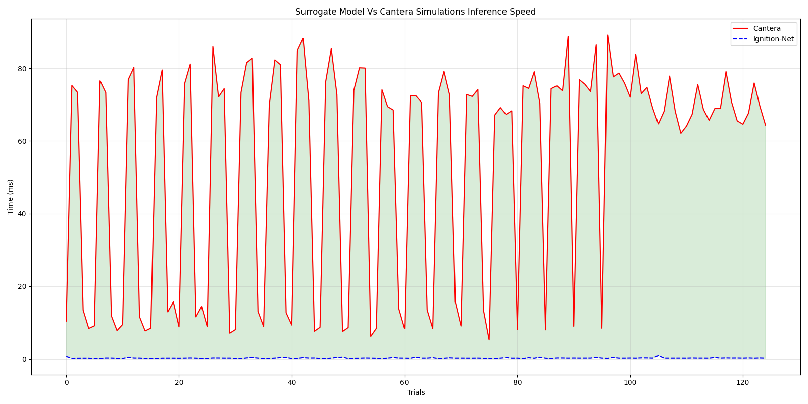
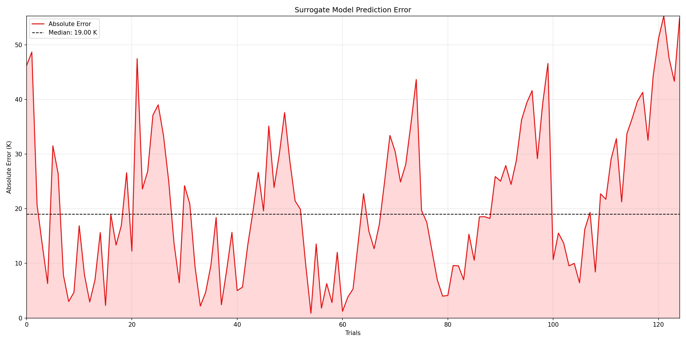

# Ignition-Net

A lightweight MLP surrogate model for predicting adiabatic flame temperature (AFT) as a function of initial temperature, pressure, and equivalence ratio. Ignition-Net is trained on data generated by the [Cantera](https://cantera.org/) combustion toolkit using the JetSurF 2.0 reaction mechanism, and achieves ~1000× inference speedup over direct Cantera simulation with a median absolute error of 21.73 K.

---

## Motivation

High-fidelity combustion simulations are computationally expensive. A single Cantera equilibrium solve takes on the order of ~1000 ms, making parametric sweeps or real-time applications impractical at very large scale. Ignition-Net replaces this solver with a neural network that predicts AFT in under 1 ms, enabling rapid exploration of the (T₀, P, φ) parameter space.

---

## Model

Ignition-Net is a fully connected MLP implemented in PyTorch.

```
Input  (3)  →  Linear(3, 32) 
            →  ReLU
            →  Linear(32, 32) 
            →  ReLU
            →  Linear(32, 1)
Output (1)  →  Adiabatic Flame Temperature (K)
```

**Inputs**

| Feature | Symbol | Range |
|---|---|---|
| Initial temperature | T₀ | 400 – 1000 K |
| Pressure | P | 5 – 40 atm |
| Equivalence ratio | φ | 0.5 – 2.0 |

**Output**: Adiabatic Flame Temperature (K)

Input features are standardized to zero mean and unit variance using a `StandardScaler` fit on the training set. The scaler parameters are saved alongside the model weights and applied at inference time.

---

## Dataset

Training data was generated using Cantera's `gas.equilibrate('HP')` routine with the JetSurF 2.0 mechanism. The dataset is a full combinatorial grid across the three input dimensions:

```python
temperatures = np.linspace(400.0, 1000.0, num = 25)  # K
pressures    = np.linspace(5.0,   40.0,   num = 25)  # atm
phis         = np.linspace(0.5,   2.0,    num = 25)  # dimensionless
```

This yields **15,625 samples** (25³), split 70/20/10 into train, test, and validation sets using `torch.utils.data.random_split`.

---

## Training

The model was trained for 100 epochs using the Adam optimizer with MSE loss on raw Kelvin targets (no target scaling). Training converged rapidly — train loss dropped from 6838 in epoch 1 to under 5 by epoch 25, with validation loss stabilizing below 10 for the majority of training.

| Metric | Value |
|---|---|
| Epochs | 100 |
| Avg train loss (MSE) | 75.61 |
| Avg val loss (MSE) | 8.59 |
| R² | 0.99 |
| NRMSE | 0.01 |
| MAE | 0.01 |

---

## Results

### Inference Speed

Ignition-Net is approximately **1000× faster** than Cantera across the full parameter sweep. Cantera requires ~1000–1200 ms per call; the surrogate completes inference in under 1 ms.



The green shaded region shows the speedup margin between the two methods across 15,625 input conditions. The surrogate line (blue, dashed) is nearly indistinguishable from zero on this scale.

### Prediction Error

The surrogate achieves a **median absolute error of 19.00 K** against Cantera ground truth across the full parameter sweep.



Error is largest at extreme equivalence ratios (very lean or very rich), where the AFT surface has the steepest gradients. The bulk of predictions fall within ±20 K of the Cantera solution.

---

## Usage

**Training**

```bash
python train.py
```

**Inference**

```python
from model import IgnitionNet
from scaler import StandardScaler

model  = IgnitionNet.load("ignition_net.pt", input_dims = 3, output_dims = 1)
scaler = StandardScaler.load("scaler.npz")

t_ad = model_inference(model, scaler, t0 = 800.0, p_atm = 20.0, phi = 1.0)
print(f"Adiabatic Flame Temperature: {t_ad:.2f} K")
```

---

## Limitations

- Valid only within the training domain: T₀ ∈ [400, 1000] K, P ∈ [5, 40] atm, φ ∈ [0.5, 2.0]. Extrapolation outside this range is unreliable.
- Trained on A1 surrogate fuel with JetSurF 2.0. Performance on other fuels or mechanisms is not guaranteed.
